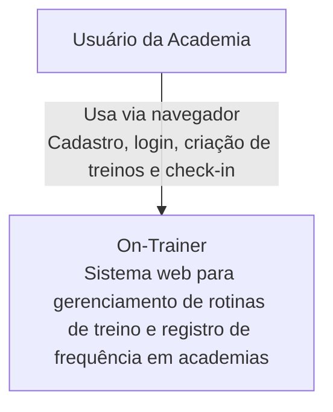

# On-Trainer
Um Trabalho Feito Por Gabriel Albani e Miguel .A Guedes

Domínio do Problema

Muitos frequentadores de academia não possuem uma forma simples e organizada de registrar seus treinos e acompanhar sua frequência. Normalmente utilizam anotações em papel ou aplicativos complexos.
O sistema proposto tem como objetivo permitir:

Cadastro de usuários
Login no sistema
Criação de rotinas de treino (ex: “Treino de Perna”)
Associação de exercícios a uma rotina
Edição e exclusão de rotinas
Registro de check-in na academia
Visualização do histórico de check-ins

Requisitos Funcionais (RF)

RF01 – O sistema deve permitir cadastro de usuário.

RF02 – O sistema deve permitir login com e-mail e senha.

RF03 – O usuário deve poder criar uma rotina de treino.

RF04 – O usuário deve poder associar exercícios à rotina.

RF05 – O usuário deve poder registrar check-in.

RF06 – O sistema deve permitir visualizar histórico de check-ins.

Requisitos Não Funcionais (RNF)

RNF01 – O sistema deve ser acessível via navegador.

RNF02 – O tempo de resposta deve ser inferior a 3 segundos.

RNF03 – As senhas devem ser armazenadas de forma segura.

RNF04 – A interface deve ser simples e intuitiva.

Principais Tecnologias e Justificativas

Backend

Java
Justificativa: Linguagem robusta, orientada a objetos e amplamente utilizada no mercado.
Spring Boot
Justificativa: Framework que facilita a criação de APIs REST com Java, reduzindo configuração e aumentando produtividade.

Banco de Dados

MySQL
Justificativa: Banco de dados relacional confiável, gratuito e adequado para modelagem com relacionamentos entre usuários, rotinas, exercícios e check-ins.

Frontend
HTML, CSS e JavaScript
Justificativa: Tecnologias leves e suficientes para desenvolver uma interface web simples para o sistema.

Controle de Versão
Git e GitHub
Justificativa: Permitem versionamento do código e colaboração entre os integrantes da dupla.

Organização Simples de Tarefas (Dupla)

Integrante 1:

Desenvolvimento do backend (Java e Spring Boot)
Modelagem do banco de dados
Implementação do sistema de check-in
Criação das APIs

Integrante 2:

Desenvolvimento do frontend
Criação das telas (cadastro, login, rotinas e check-in)
Integração com a API
Documentação do projeto

FIGMA

https://www.figma.com/design/iwhrNspDMjd0KwXAa3tgmk/On-Trainer?node-id=0-1&t=z4CJK0AmPcUYQEhI-1

Modelo C4

1) Nível 1 — Diagrama de Contexto

2) Nível 2 — Diagrama de Containers
 ```mermaid
flowchart TD
    U[Usuário da Academia]
    N[Navegador]
    F[Frontend Web<br/>HTML, CSS e JavaScript<br/><br/>Responsável pela interface do usuário,<br/>formulários de cadastro/login,<br/>criação de treinos e histórico de check-ins]
    B[Backend API<br/>Java + Spring Boot<br/><br/>Responsável por autenticação,<br/>gerenciamento de rotinas,<br/>associação de exercícios<br/>e registro de check-ins]
    DB[(Banco de Dados<br/>MySQL<br/><br/>Armazena usuários,<br/>rotinas, exercícios e check-ins)]
 
    U -->|Acessa o sistema| N
    N -->|Renderiza interface| F
    F -->|Requisições via API REST| B
    B -->|Consultas e persistência SQL| DB
```
3) Nível 3 — Diagrama de Componentes do Backend

 ```mermaid
flowchart TD
    subgraph Controllers["Camada de Controllers"]
        AC["AuthController<br/>Responsável por cadastro e login"]
        UC["UserController<br/>Responsável por dados do usuário"]
        WC["WorkoutController<br/>Responsável por criar, editar e excluir treinos"]
        EC["ExerciseController<br/>Responsável por gerenciar exercícios"]
        CC["CheckinController<br/>Responsável por registrar check-in e consultar histórico"]
    end
 
    subgraph Services["Camada de Services"]
        US["UserService<br/>Validação de usuário, senha e regras de autenticação"]
        WS["WorkoutService<br/>Regras de negócio das rotinas de treino"]
        ES["ExerciseService<br/>Regras de negócio dos exercícios"]
        CS["CheckinService<br/>Registro e consulta de frequência"]
    end
 
    subgraph Repositories["Camada de Repositories"]
        UR["UserRepository"]
        WR["WorkoutRepository"]
        ER["ExerciseRepository"]
        CR["CheckinRepository"]
    end
 
    DB[("MySQL Database")]
 
    AC --> US
    UC --> US
    WC --> WS
    EC --> ES
    CC --> CS
 
    US --> UR
    WS --> WR
    WS --> UR
    ES --> ER
    ES --> WR
    CS --> CR
    CS --> UR
 
    UR --> DB
    WR --> DB
    ER --> DB
    CR --> DB
```
Banco de Dados por extenso, por conta de não ter conseguido dar commit

CREATE DATABASE on_trainer;


\c on_trainer;


CREATE TABLE users (
    id SERIAL PRIMARY KEY,
    name VARCHAR(100) NOT NULL,
    email VARCHAR(150) UNIQUE NOT NULL,
    password VARCHAR(255) NOT NULL,
    created_at TIMESTAMP DEFAULT CURRENT_TIMESTAMP
);


CREATE TABLE workout_routines (
    id SERIAL PRIMARY KEY,
    user_id INT NOT NULL,
    name VARCHAR(100) NOT NULL,
    description TEXT,
    created_at TIMESTAMP DEFAULT CURRENT_TIMESTAMP,

    CONSTRAINT fk_user
        FOREIGN KEY (user_id)
        REFERENCES users(id)
        ON DELETE CASCADE
);


CREATE TABLE exercises (
    id SERIAL PRIMARY KEY,
    name VARCHAR(100) NOT NULL,
    muscle_group VARCHAR(50)
);


CREATE TABLE routine_exercises (
    id SERIAL PRIMARY KEY,
    routine_id INT NOT NULL,
    exercise_id INT NOT NULL,
    sets INT,
    reps INT,

    CONSTRAINT fk_routine
        FOREIGN KEY (routine_id)
        REFERENCES workout_routines(id)
        ON DELETE CASCADE,

    CONSTRAINT fk_exercise
        FOREIGN KEY (exercise_id)
        REFERENCES exercises(id)
        ON DELETE CASCADE
);


CREATE TABLE checkins (
    id SERIAL PRIMARY KEY,
    user_id INT NOT NULL,
    checkin_date TIMESTAMP DEFAULT CURRENT_TIMESTAMP,

    CONSTRAINT fk_checkin_user
        FOREIGN KEY (user_id)
        REFERENCES users(id)
        ON DELETE CASCADE
);


