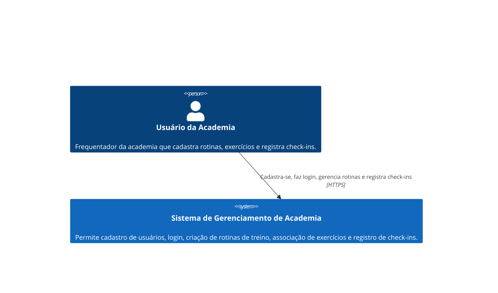
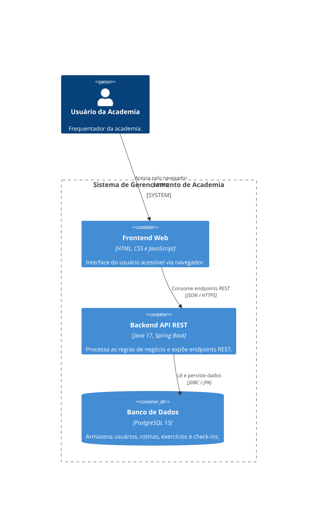

# On Trainer

> Um trabalho feito por **Gabriel Albani** e **Miguel A. Guedes**

Sistema web para registro e acompanhamento de treinos de academia.

---

## Domínio do Problema

Muitos frequentadores de academia não possuem uma forma simples e organizada de registrar seus treinos e acompanhar sua frequência. Normalmente utilizam anotações em papel ou aplicativos complexos.

O sistema proposto tem como objetivo permitir:

- Cadastro de usuários
- Login no sistema
- Criação de rotinas de treino (ex: "Treino de Perna")
- Associação de exercícios a uma rotina
- Edição e exclusão de rotinas
- Registro de check-in na academia
- Visualização do histórico de check-ins

---

## Requisitos Funcionais (RF)

| Código | Descrição |
|--------|-----------|
| RF01 | O sistema deve permitir cadastro de usuário. |
| RF02 | O sistema deve permitir login com e-mail e senha. |
| RF03 | O usuário deve poder criar uma rotina de treino. |
| RF04 | O usuário deve poder associar exercícios à rotina. |
| RF05 | O usuário deve poder registrar check-in. |
| RF06 | O sistema deve permitir visualizar histórico de check-ins. |

---

## Requisitos Não Funcionais (RNF)

| Código | Descrição |
|--------|-----------|
| RNF01 | O sistema deve ser acessível via navegador. |
| RNF02 | O tempo de resposta deve ser inferior a 3 segundos. |
| RNF03 | As senhas devem ser armazenadas de forma segura. |
| RNF04 | A interface deve ser simples e intuitiva. |

---

## Principais Tecnologias e Justificativas

### Backend

- **Java** — Linguagem robusta, orientada a objetos e amplamente utilizada no mercado.
- **Spring Boot** — Framework que facilita a criação de APIs REST com Java, reduzindo configuração e aumentando produtividade.

### Banco de Dados

- **PostgreSQL** — Banco de dados relacional confiável, gratuito e adequado para modelagem com relacionamentos entre usuários, rotinas, exercícios e check-ins.

### Frontend

- **HTML, CSS e JavaScript** — Tecnologias leves e suficientes para desenvolver uma interface web simples para o sistema.

### Controle de Versão

- **Git e GitHub** — Permitem versionamento do código e colaboração entre os integrantes da dupla.

---

## Organização Simples de Tarefas (Dupla)

**Integrante 1**
- Desenvolvimento do backend (Java e Spring Boot)
- Modelagem do banco de dados
- Implementação do sistema de check-in
- Criação das APIs

**Integrante 2**
- Desenvolvimento do frontend
- Criação das telas (cadastro, login, rotinas e check-in)
- Integração com a API
- Documentação do projeto

---

## Figma

[Protótipo no Figma — On Trainer](https://www.figma.com/design/iwhrNspDMjd0KwXAa3tgmk/On-Trainer?node-id=0-1&t=z4CJK0AmPcUYQEhI-1)

## Nível 1 — Diagrama de Contexto

```mermaid
C4Context
 
    Person(usuario, "Usuário da Academia", "Frequentador da academia que cadastra rotinas, exercícios e registra check-ins.")
 
    System(sistemaAcademia, "Sistema de Gerenciamento de Academia", "Permite cadastro de usuários, login, criação de rotinas de treino, associação de exercícios e registro de check-ins.")
 
 
    Rel(usuario, sistemaAcademia, "Cadastra-se, faz login, gerencia rotinas e registra check-ins", "HTTPS")
```

## Nível 2: - Diagrama de Contêineres

```mermaid
C4Container
 
 
   Person(usuario, "Usuário da Academia", "Frequentador da academia.")
 
   System_Boundary(sistemaAcademia, "Sistema de Gerenciamento de Academia") {
       Container(frontend, "Frontend Web", "HTML, CSS e JavaScript", "Interface do usuário acessível via navegador.")
       Container(backend, "Backend API REST", "Java 17, Spring Boot", "Processa as regras de negócio e expõe endpoints REST.")
       ContainerDb(bancoDados, "Banco de Dados", "PostgreSQL 15", "Armazena usuários, rotinas, exercícios e check-ins.")
   }
 
   Rel(usuario, frontend, "Acessa pelo navegador", "HTTPS")
   Rel(frontend, backend, "Consome endpoints REST", "JSON / HTTPS")
   Rel(backend, bancoDados, "Lê e persiste dados", "JDBC / JPA")
```
## Nível 3: - Diagrama de Componentes

```mermaid
C4Component
 
 
    Person(usuario, "Usuário da Academia", "Frequentador da academia.")
    Container(frontend, "Frontend Web", "HTML, CSS e JavaScript", "Interface web.")
    ContainerDb(bancoDados, "Banco de Dados", "PostgreSQL 15", "Armazena todos os dados.")
 
    Container_Boundary(backend, "Backend API REST") {
        Component(securityConfig, "Security Config", "Spring Security", "Configura autenticação JWT e controle de acesso.")
        Component(jwtUtil, "JWT Util", "JJWT Library", "Gera e valida tokens JWT.")
 
        Component(authController, "Auth Controller", "REST Controller", "Endpoints POST /auth/register e POST /auth/login.")
        Component(authService, "Auth Service", "Spring Service", "Lógica de cadastro, validação e geração de token.")
        Component(passwordEncoder, "Password Encoder", "Spring Security", "Hash seguro de senhas com BCrypt.")
 
        Component(usuarioController, "Usuario Controller", "REST Controller", "Endpoint GET /usuarios/me.")
        Component(usuarioService, "Usuario Service", "Spring Service", "Lógica de perfil do usuário.")
        Component(usuarioRepository, "Usuario Repository", "Spring Data JPA", "Acesso à tabela usuarios.")
 
        Component(rotinaController, "Rotina Controller", "REST Controller", "Endpoints CRUD /rotinas.")
        Component(rotinaService, "Rotina Service", "Spring Service", "Lógica de gerenciamento de rotinas.")
        Component(rotinaRepository, "Rotina Repository", "Spring Data JPA", "Acesso à tabela rotinas.")
 
        Component(exercicioController, "Exercicio Controller", "REST Controller", "Endpoints CRUD /rotinas/{id}/exercicios.")
        Component(exercicioService, "Exercicio Service", "Spring Service", "Lógica de associação de exercícios.")
        Component(exercicioRepository, "Exercicio Repository", "Spring Data JPA", "Acesso à tabela exercicios.")
 
        Component(checkinController, "Checkin Controller", "REST Controller", "Endpoints POST /checkins e GET /checkins.")
        Component(checkinService, "Checkin Service", "Spring Service", "Lógica de registro e histórico de check-ins.")
        Component(checkinRepository, "Checkin Repository", "Spring Data JPA", "Acesso à tabela checkins.")
    }
 
    Rel(frontend, authController, "POST /auth/register, POST /auth/login", "JSON / HTTPS")
    Rel(frontend, usuarioController, "GET /usuarios/me", "JSON / HTTPS")
    Rel(frontend, rotinaController, "CRUD /rotinas", "JSON / HTTPS")
    Rel(frontend, exercicioController, "CRUD /rotinas/{id}/exercicios", "JSON / HTTPS")
    Rel(frontend, checkinController, "POST e GET /checkins", "JSON / HTTPS")
 
    Rel(securityConfig, jwtUtil, "Valida token JWT")
    Rel(authController, authService, "Delega cadastro e login")
    Rel(authService, passwordEncoder, "Hash e verificação de senha")
    Rel(authService, jwtUtil, "Gera token após autenticação")
    Rel(authService, usuarioRepository, "Salva e consulta usuário")
 
    Rel(usuarioController, usuarioService, "Delega consulta de perfil")
    Rel(usuarioService, usuarioRepository, "Consulta dados do usuário")
 
    Rel(rotinaController, rotinaService, "Delega CRUD de rotinas")
    Rel(rotinaService, rotinaRepository, "Persiste e consulta rotinas")
    Rel(rotinaService, usuarioRepository, "Verifica propriedade da rotina")
 
    Rel(exercicioController, exercicioService, "Delega gerenciamento de exercícios")
    Rel(exercicioService, exercicioRepository, "Persiste e consulta exercícios")
    Rel(exercicioService, rotinaRepository, "Verifica existência da rotina")
 
    Rel(checkinController, checkinService, "Delega registro e consulta")
    Rel(checkinService, checkinRepository, "Persiste e consulta check-ins")
    Rel(checkinService, usuarioRepository, "Associa check-in ao usuário")
 
    Rel(usuarioRepository, bancoDados, "Tabela usuarios", "JPA/JDBC")
    Rel(rotinaRepository, bancoDados, "Tabela rotinas", "JPA/JDBC")
    Rel(exercicioRepository, bancoDados, "Tabela exercicios", "JPA/JDBC")
    Rel(checkinRepository, bancoDados, "Tabela checkins", "JPA/JDBC")
```
## UML Banco de Dados 

